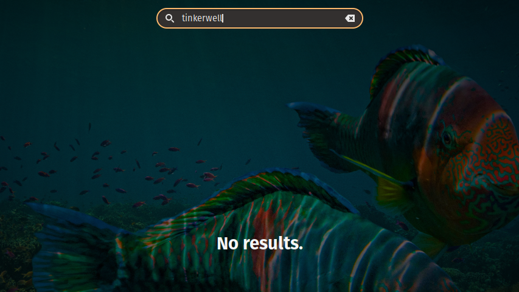
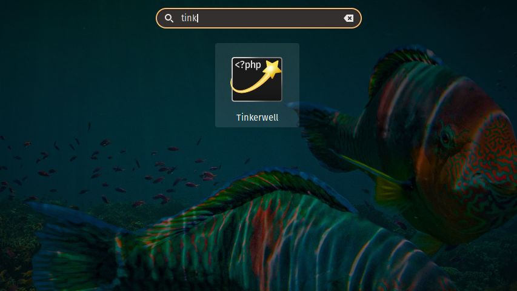

[Tinkerwell](https://tinkerwell.app/) is one in the growing list of apps created
by [BeyondCode](https://beyondco.de/). This Desktop app allows you to execute
PHP code from a
[REPL interface](https://en.wikipedia.org/wiki/Read%E2%80%93eval%E2%80%93print_loop),
which can be connected to a local environment, the production one or even a
Docker container! 👀

## Why Tinkerwell?

This incredible app was developed with the Laravel Developer in mind, to
simplify the work that we all already do: Use the
[`tinker`](https://github.com/laravel/tinker) tool. 🤔

`tinker` is a package created by the core laravel team, which uses the
[psysh REPL](https://psysh.org/) under the hood. This allows developers to
_tinker_ with their Laravel applications directly, executing code in the console
and seeing the results right away, without needing to enter debug mode, or
create test routes to verify that a simple Eloquent query work as they expect.

`Tinkerwell` was born to provide the same benefits from `tinker`, but packed
with a pretty UI, and the ability to switch context without having to leave the
app ❤️.

Oh... By the way... This app is multi-platform! It is available for Windows,
macOS and Linux 😍.

## Linux? Where do I sign?

Well, you can buy a Tinkerwell license in their website without hesitation, no
compromises!

Now, one thing you need to know about the Linux compatibility is that it's
distributed via [AppImage](https://appimage.org/) packages, which is a simple
executable form factor that doesn't require the end user to install system
libraries nor recompile their kernel for an app to run.

In my opinion, this was the right move.

However, AppImages do come with a cost: Lack of system integration.

As many Linux users may know, most Desktop Environments come with the ability to
display your Desktop applications in their own application menu, however, since
AppImages are not meant to be _installed_, they will not show in your
application list.



Today, I'm here to tell you there's a way to solve this and provide neat
discoverability for your application when using the GNOME Desktop Environment
👨‍💻...

## Tinkering with GNOME

It is stated
[in the GNOME Documentation](https://developer.gnome.org/integration-guide/stable/desktop-files.html.en),
that you can create your own application shortcuts by creating files with the
extension `.desktop` and linking them in one of the corresponding directories.

> From this point forward, I'm going to assume that you have downloaded the
> Tinkerwell AppImage in the `~/Applications/Tinkerwell/` directory

First, verify that your AppImage is executable, otherwise, make it executable
using the command:

```shell
chmod a+rx ~/Applications/Tinkerwell/Tinkerwell.AppImage
```

Before creating our Desktop Entry, we must get an icon for our start menu. You
can simply google for the `tinkerwell icon` and just save it in the same
directory as the AppImage file.

Now, let's create the Desktop shortcut for Tinkerwell. I'll be creating it in
the same directory that Tinkerwell was downloaded:

```shell
touch ~/Applications/Tinkerwell/beyondcode-tinkerwell.desktop
```

To keep things simple, you can copy and paste the following Desktop Entry:

```
[Desktop Entry]
Name=Tinkerwell
Exec=/home/<your-user>/Applications/Tinkerwell/Tinkerwell.AppImage
Icon=/home/<your-user>/Applications/Tinkerwell/icon.png
Type=Application
Categories=tinkerwell;electron;php;beyondcode;laravel;
```

> Remember to specify your user's path properly, as well as the AppImage name
> and icon file name.

Once you created your Desktop Entry and properly referenced both the AppImage
and icon files, it's time to tell GNOME to include your application. In this
case, we will be creating a
[Symbolic link](https://en.wikipedia.org/wiki/Symbolic_link) to our desktop
entry:

```shell
# Remember: The syntax for the link command is
#     ln -s <TARGET> <LINK_NAME>
# In other words, it means
#     ln -s <ORIGIN> <DESTINATION>

# Important: You must always reference absolute (full) paths when creating any type of links.

ln -s \
  /home/<your-user>/Applications/Tinkerwell/beyondcode-tinkerwell.desktop \
  /home/<your-user>/.local/share/applications/beyondcode-tinkerwell.desktop
```

If you read the GNOME documentation linked previously, you would remember that
linking a Desktop Entry file to `~/.local/share/applications/` will allow GNOME
to index and display your application in their main menu 🔮.

Now, in order to tell GNOME to immediately show us the way, we must run the
following command:

```shell
# Look ma! No sudo!
update-desktop-database
```

If every piece is properly configured, we should now see tinkerwell in our
application menu! 🎉



Now, besides having such a powerful tool at your disposition, you also have a
quick access entry in your application menu 🏃‍♂️.
