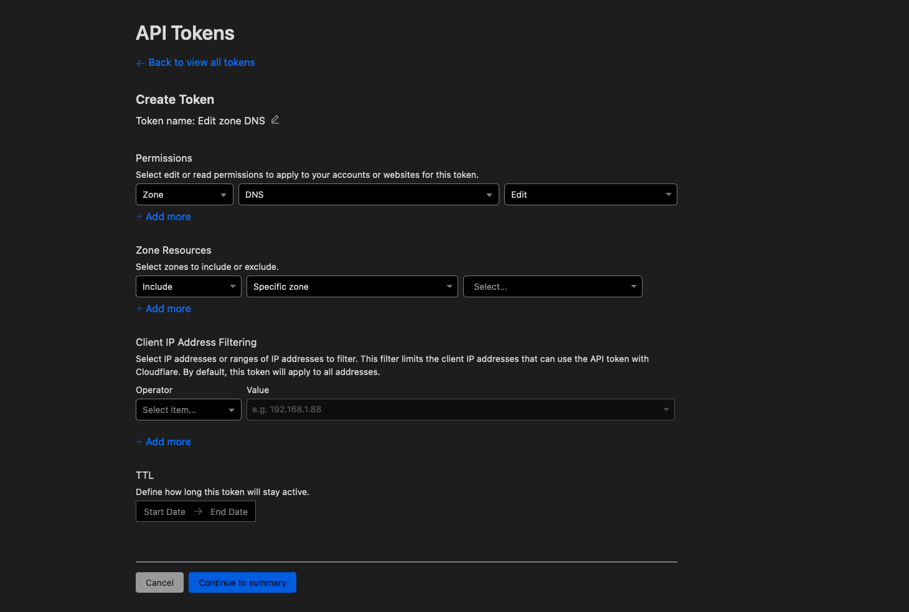
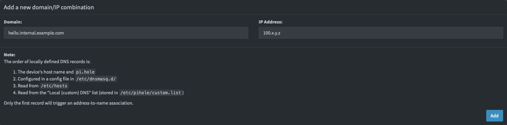
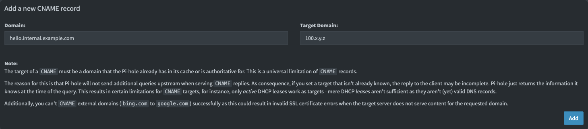
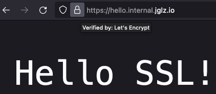

Back in the day, managing SSL certificates for your websites was more like a chore than an _useful_ task; it
involved time, tears and prays to the Sysadmin gods hoping that your websites will not break when updating
its SSL certificates.

Up to this point, I'm pretty sure many of you have heard about [Caddy](https://caddyserver.com/), the _Ultimate Server_.
At least to me, Caddy has been a godsend because it has _Automatic SSL Renewal_ and I can just:

1. Spin up a Server
2. Upload my application
3. Install Caddy
4. Wire my domain to Caddy
5. Enjoy

However, I'm pretty sure there are a lot of enthusiasts out there that, like me, that also deploy web applications
that are not meant for public access, and instead, we lock down our applications behind VPNs, cornering us to
start using self-signed certificates again and lose the beautiful (and soon to dissapear anyways) green
lock icons, or have warnings start popping up in our browsers every time we are filling a _credential_ field on
our websites.

But not everything in life is as bad as it seems. Caddy has a powerful API and a fantastic community that develop
tools to circumvent almost any issue we may think of in order to make Caddy the best option for our very specific
use cases.

There are a lot of [Caddy DNS Modules](https://github.com/caddy-dns) available that we can use to tell Caddy
to pull SSL Certificates automatically and solve the CA challenges using DNS instead of trying to ping
our server via IP address.

These modules can help us deploy SSL certificates on our internal networks, even if the host is not reachable to the
public internet at all due to firewalls, NAT gateways, or because we're [running our apps in Docker](#beyond-private-networks) 🐋.

## Example use case

In this example use case, we will mix a _public domain_ with a _private sub-domain_ to a simple `Hello world!` server:

- We will use a homelab server, which is only accessible from a VPN and not from the public Internet.
- We need a _public domain_, and for this post, we will be managing it with [Cloudflare](https://www.cloudflare.com/).
  You can use any DNS manager of your choice as long as there is a Caddy DNS Module for it.
- The _private sub-domain_ to use is `hello.internal.` and it will be managed using [Pi-hole](https://pi-hole.net/).
- And, obviously, we are going to use Caddy as the server.

## 1. Compiling Caddy

Caddy needs to perform a _challenge_ in order to obtain the SSL certificate for our domain, but as our server is not
reachable from the public internet, we will be installing the [Cloudflare module for Caddy](https://github.com/caddy-dns/cloudflare)
that will allow Caddy to receive the challenge in form on a TXT Record challenge and automatically issue the
value via the Cloudflare API, and remove it once the SSL certificate has been issued.


To compile Caddy with this module, we can use the [xcaddy](https://caddyserver.com/docs/build#xcaddy) command:

```sh
xcaddy build \
  --with github.com/caddy-dns/cloudflare
```

This will generate a new Caddy executable with the Cloudflare module ready to use!

## 2. Issuing a Cloudflare API Token

To connect the Cloudflare Module to your Cloudflare account, head to your [Account's API Tokens](https://dash.cloudflare.com/profile/api-tokens) page and create a new token.

Here, we will need to give our token access to _Edit Zone DNS_, the template with the same name is really helpful.



Make sure to select the correct zone to give access to from this token, as well as to save the API Token as we will
later on need to provide it in our Caddy configuration.

## 3. Setting up our sub-domain in Pi-hole

Now, before continuing, we must make the `hello.internal.` subdomain available to our devices, so let's open Pi-hole.

You can register the DNS record using IPv4/IPv6 by visiting `/admin/dns_records.php` in your Pi-hole dashboard:


Or you can do CNAME by visiting `/admin/cname_records.php`:


## 4. Configure our Caddyfile

Finally, let's set up our Caddy file.

We must first tell caddy to use the Clouflare Module for SSL, after that, we can add our application code.

```caddy
tls {
  dns cloudflare {CLOUDFLARE_API_TOKEN}
}

hello.internal.jglz.io {
  respond "Hello SSL!"
}
```

Now, when we navigate to our application, we can see Caddy responding our requests with SSL!



## Beyond private networks

As I mentioned previously, we may also be running our applications inside Docker containers, and this can make it
_a bit more tedious_ to manage. Sure, the steps above help if we have Caddy installed directly on our server and
just point the `reverse_proxy` directives to our containers' internal IP addresses.

There are cases when in a certain server we run everything inside containers _because its easier_, and if this
fits the description of one of your servers, then I know of a wonderful tool to share with you!

[Lucas Lorentz](https://github.com/lucaslorentz) created a great module for Caddy called [caddy-docker-proxy](https://github.com/lucaslorentz/caddy-docker-proxy)
that allows Caddy to proxy requests to Docker containers with a really simple config.
He also publishes a Caddy container with the module already included to make it easier for us to test and play with it.

> Please read the [caddy-docker-proxy](https://github.com/lucaslorentz/caddy-docker-proxy#table-of-contents)
> documentation before continuing.

For this example, we are going to run Caddy as its own container and add the Cloudflare DNS module as well as the
Docker Proxy module.

First, we need to compile Caddy with both modules, and as we're running Caddy as a container we don't need to have
`xcaddy` available locally, instead, we will create our own `Dockerfile` that compiles Caddy for us.

```docker
ARG CADDY_VERSION=2.6.4
FROM caddy:${CADDY_VERSION}-builder-alpine AS builder

RUN xcaddy build \
    --with github.com/lucaslorentz/caddy-docker-proxy/v2 \
    --with github.com/caddy-dns/cloudflare

FROM caddy:${CADDY_VERSION}-alpine

COPY --from=builder /usr/bin/caddy /usr/bin/caddy

CMD ["caddy", "docker-proxy"]
```

Now, we can fire Caddy via Docker Compose (or the traditional Docker CLI if you prefer) and have SSL work there as well!

```yaml
version: '3.7'

services:
  caddy:
    container_name: caddy
    build: /path/to/Dockerfile
    ports:
      - '80:80' # Remember that Caddy does HTTP to HTTPS redirections automatically.
      - '443:443'
    environment:
      - CADDY_INGRESS_NETWORK=caddy
      # If you don't want to write your token here, remember that Docker Compose picks up
      # variables from an .env file if present in the same directory as the compose file.
      - CLOUDFLARE_API_TOKEN=<secret>
    networks:
      - caddy
    labels:
      caddy.acme_dns: cloudflare ${CLOUDFLARE_API_TOKEN}
      caddy: hello.internal.example.com
      caddy.respond: '"Hello SSL!"'
    volumes:
      - '/var/run/docker.sock:/var/run/docker.sock'
      # It is important to have these to conserve data after the container restarts
      - '/path/to/persistent/caddy/data:/data'
    # Unless we want to SSH to our server every time it restarts.
    restart: unless-stopped

networks:
  caddy:
    name: caddy
```

If you are running Pi-hole as a container as well, then you may feel tempted to add
SSL to it as well (It's free! 🤑), unfortunately, it is not possible to request SSL certificates
for the default `pi.hole` domain.

What we can do instead, is to tell Pi-hole to also work on another domain via the `VIRTUAL_HOST`
environment variable and then wire the `pihole.internal.` subdomain to it and to Caddy. Finally, we can also make
it so requests coming to `pi.hole` are redirected to our `pihole.internal.` subdomain by Caddy.

> Don't forget to add `pihole.internal.` to your Pi-hole DNS/CNAME records.

```yaml
version: '3.7'

services:
  caddy:
    # ...
  
  pihole:
    # ...
    environment:
      # ...
      - VIRTUAL_HOST: 'pihole.internal.example.com'
    networks:
      - caddy
    labels:
      # Numeric suffixes help the caddy-docker-proxy module
      # understand which labels should be grouped together.
      caddy_0: pihole.internal.example.com
      caddy_0.reverse_proxy: "{{upstreams}}"
      # Yes, only do redirect on port 80 as 443 will fail to resolve SSL.
      caddy_1: pi.hole:80
      caddy_1.redir: https://pihole.internal.example.com{uri} permanent
    depends_on:
      - caddy

networks:
  caddy:
    name: caddy
```

Let me know what you think (or if you have a joke) [@iksaku2](https://twitter.com/iksaku2). Thank you for reading 🦑.